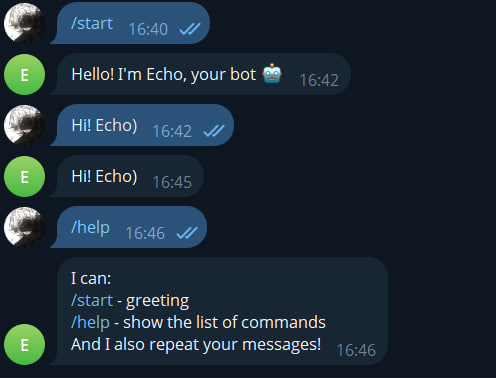

# Telegram Echo Bot

Простой учебный Telegram-бот на Python, который повторяет сообщения пользователя.

## 🚀 Как запустить

1. Установите зависимости:

pip install python-telegram-bot --upgrade (Эту команду писать в терминал)

2. Вставьте свой токен от BotFather в файл `bot.py`. (токен BotFather выдаёт после того как бот создан)

3. Запустите бота:

python bot.py (также писать в терминал, учтите что путь к боту в терминале должен быть правильным)

## 📋 Команды
- `/start` — приветствие
- `/help` — список команд
- Эхо — бот повторяет любое сообщение

---

## 🎯 Цель проекта
Это мой первый учебный проект для портфолио. Он показывает базовые навыки работы с Python и библиотекой `python-telegram-bot`.

## 📸 Скриншоты работы бота

